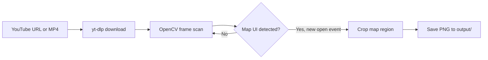

# HLL YouTube Map Capture

Automatically scan Hell Let Loose YouTube gameplay videos at high speed and save screenshots of the tactical map each time it opens.

This is a standalone Python tool. It downloads a video (or reads a local file), skips frames to scan faster than real time, detects when the in-game map UI is visible, and saves a cropped map image.

## How it works



Map detection uses ORB feature matching against HLL UI templates (adapted from [obs-screen-recognition](https://github.com/isaac-jordan/obs-screen-recognition)). When the map transitions from closed to open, one screenshot is saved. Duplicate frames while the map stays open are skipped.

## Requirements

- Python 3.10+
- ffmpeg (for merging YouTube audio/video streams)

## Quick start

```bash
cd hll-youtube-map-capture
python -m venv .venv

# Windows
.venv\Scripts\activate

# macOS / Linux
source .venv/bin/activate

pip install -r requirements.txt
```

Capture maps from a YouTube URL:

```bash
python -m hll_map_capture "https://www.youtube.com/watch?v=YOUR_VIDEO_ID"
```

Or from a local recording:

```bash
python -m hll_map_capture ./my_hll_vod.mp4 --speed 8
```

Screenshots are written to `output/` with timestamps in the filename.

## Options

| Flag | Description |
|------|-------------|
| `--speed N` | Process every Nth frame (default: 4). Use 8–16 for long VODs. |
| `--output DIR` | Where to save map images (default: `output/`) |
| `--config FILE` | YAML settings file (see `config.example.yaml`) |
| `--debug` | Print each saved file and timestamp |
| `--no-keep-download` | Delete the cached YouTube download after processing |

## Tuning

If detection misses maps or triggers too often, copy `config.example.yaml` to `config.yaml` and adjust:

- **`detection.min_good_matches`** — lower = more sensitive, higher = stricter
- **`processing.speed_factor`** — higher = faster scan, but may skip brief map opens
- **`map_crop.*`** — crop box for the tactical map only (fractions of frame width/height)

For streams that are not 1080p, the detector scales frames before matching. If your source is 1440p native, add 1440p templates under `templates/1440p/` and set `template_resolution: 1440`.

## Output example

```
output/
  dQw4w9WgXcQ_map_001_02m14s.png
  dQw4w9WgXcQ_map_002_08m41s.png
  dQw4w9WgXcQ_map_003_15m02s.png
```

Each file is a cropped tactical map from that moment in the video.

## Limitations

- Works best on first-person HLL gameplay where the player opens the tactical map (M key). Spectator or minimap-only views may not match.
- Stream overlays (webcam, chat, custom HUD) can interfere with detection — tune `map_crop` and `min_good_matches` if needed.
- YouTube download quality is capped at 1080p by default for speed and compatibility.

## License note

Detection templates in `templates/` are derived from the MIT-licensed [obs-screen-recognition](https://github.com/isaac-jordan/obs-screen-recognition) HLL assets.
